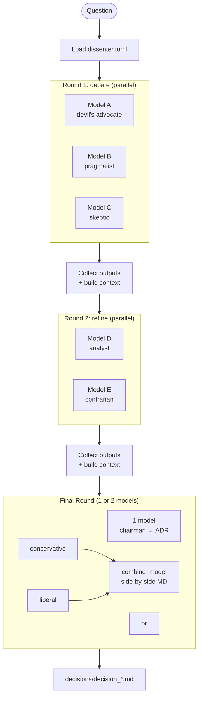

# dissenter

[](https://pypi.org/project/dissenter/)
[](https://pypi.org/project/dissenter/)
[](LICENSE)
[](https://github.com/PR0CK0/dissenter/actions/workflows/publish.yml)
[](https://docs.litellm.ai/)
[](https://github.com/astral-sh/uv)
[](https://docs.litellm.ai/docs/providers)

**Run multiple LLMs through a structured debate for complex questions. Surface where they disagree. Synthesize a decision.**

```bash
make ask Q="Should I use Kafka or a Postgres outbox pattern for event-driven microservices?"
```

---

## Table of Contents

- [Why this exists](#why-this-exists)
- [What the existing tools get wrong](#what-the-existing-tools-get-wrong)
- [What dissenter does differently](#what-dissent-does-differently)
- [Architecture](#architecture)
- [Installation](#installation)
- [Running](#running)
- [Configuration](#configuration)
  - [Minimal config](#minimal-config)
  - [Multi-round](#multi-round)
  - [Dual-arbiter final](#dual-arbiter-final)
  - [CLI auth — no API keys](#cli-auth--no-api-keys)
  - [Same model, multiple roles](#same-model-multiple-roles)
  - [Random role distribution](#random-role-distribution)
  - [Per-model API key](#per-model-api-key)
- [Roles](#roles)
- [Output](#output)
- [Testing](#testing)
- [Comparison](#comparison)
- [Academic foundations](#academic-foundations)
- [Roadmap](#roadmap)

---

## Why this exists

There are already tools that aggregate multiple LLMs for consensus answers. This is not that.

Every existing tool — [llm-council](https://github.com/karpathy/llm-council), [llm-consortium](https://github.com/irthomasthomas/llm-consortium), [consilium](https://github.com/terry-li-hm/consilium), the research implementations of [Mixture of Agents](https://github.com/togethercomputer/MoA) — is trying to build a better oracle. They treat disagreement as noise to eliminate and convergence as success.

For architectural decisions, that's exactly backwards.

**When multiple expert models disagree, that disagreement tells you where the decision is genuinely hard and context-dependent.** That's not noise — it's the most useful information you can get. A tool that eliminates it to produce confident-sounding consensus is actively hiding the difficulty of your decision.

`dissenter` treats disagreement as the signal, not the problem.

---

## What the existing tools get wrong

### They use identical prompts for all models
Sending the same neutral question to five models gets you five statistically similar answers with slight variation. You're not extracting diverse perspectives — you're sampling noise from similar training distributions. The February 2025 LLM ensemble survey (arXiv 2502.18036) found this is the primary reason naive ensembles underperform.

### They chase consensus
The goal of arbiter/judge patterns in llm-council, consilium, and llm-consortium is to produce a single authoritative answer. But for architectural decisions — which involve trade-offs specific to *your* team, stack, and constraints — false consensus is worse than acknowledged uncertainty. The models don't know your system. The arbiter doesn't know your team.

### They're stateless
No tool persists your decisions. You can't ask "given we chose Kafka three months ago, how does that change this?" Every query is context-free. Architectural decisions form a causal chain; these tools treat each one as an isolated question.

### They depend on OpenRouter or require specific infrastructure
llm-consortium is a plugin for Simon Willison's `llm` tool. consilium requires a Rust binary. MoA reference implementations need TogetherAI. None mix cloud + local models cleanly without a proxy service.

### They require API keys for every model
Every tool assumes you're accessing models via API key. If you have a `claude` CLI or `gemini` CLI installed and authenticated, that credential is invisible to them — you still need a separate API key. This means you're paying twice for access you already have, and there's no path to using browser-authenticated sessions.

---

## What dissenter does differently

### 1. Multi-round debate with context passing

Models run in parallel within each round. Each subsequent round receives all prior rounds as context. A typical pipeline:

- **Round 1 (debate):** Any number of models argue from adversarial roles in parallel
- **Round 2 (refine):** A smaller panel reviews the debate and sharpens the analysis
- **Final round:** 1 chairman synthesizes into a decisive ADR, or 2 arbiters (conservative + liberal) produce side-by-side recommendations

Round depth is arbitrary. Configure as many rounds as the decision warrants.

### 2. Role-differentiated prompting

Rather than asking all models the same neutral question, each model is assigned an adversarial role with a distinct mandate. The research backing: the "Rethinking MoA" paper (OpenReview 2025) found that diversity of *framing* produces better results than diversity of *model*. You get more useful signal from one model asked with five different stances than five models asked the same way.

### 3. Roles as external files

Role prompts are not hardcoded. They live in `src/dissent/roles/*.toml` — plain text files you can read and edit. Add a new file, get a new role. No code changes required.

### 4. Dual-arbiter output

The final round can use 2 models instead of 1. A `conservative` arbiter recommends the safest proven path; a `liberal` arbiter recommends the boldest high-upside path. A `combine_model` merges them side-by-side into a single document. Useful when the right answer genuinely depends on your team's risk tolerance.

### 5. Disagreement is the output, not the problem

The synthesized ADR has a dedicated **Disagreements** section — a structured analysis of where models converged (high-confidence signals), where they diverged, and what specific context would resolve the disagreement.

### 6. Two auth modes: API key or CLI session

Every model can use either an API key **or** the authentication from an installed CLI tool — per model, mixed freely in the same config. If you have `claude` and `gemini` CLIs installed and logged in, dissenter works with zero API key configuration. See [CLI auth](#cli-auth--no-api-keys).

### 7. No OpenRouter dependency, genuine provider heterogeneity

Uses [LiteLLM](https://docs.litellm.ai/) directly — a unified interface to 100+ providers. Cloud, local, and CLI-authenticated models all participate in the same ensemble.

---

## Architecture



---

## Installation

Requires [uv](https://docs.astral.sh/uv/).

```bash
git clone <repo>
cd dissenter
make install
```

**Choose your auth method — or mix them freely:**

**Option A — CLI auth (no API keys needed)**
If you have `claude` and/or `gemini` CLIs installed and logged in, set `auth = "cli"` in your config. Done.

**Option B — API keys**
```bash
export ANTHROPIC_API_KEY=...
export GEMINI_API_KEY=...          # or GOOGLE_API_KEY
export GROQ_API_KEY=...            # optional, free tier
export PERPLEXITY_API_KEY=...      # optional, web-search grounding
```

**Option C — fully local, no credentials**
Use `make ask-test` — runs entirely on Ollama with `ministral-3:3b`. See [Testing](#testing).

For Ollama models, start `ollama serve` before running.

---

## Running

`make install` puts the package into a local `.venv`. The `dissenter` command is **not** on your PATH by default. Three options:

```bash
# Option 1 — make (recommended, always works from the project directory)
make ask Q="your question"
make show

# Option 2 — uv run (always works from the project directory)
uv run dissenter ask "your question"
uv run dissenter show

# Option 3 — install globally so bare `dissenter` works anywhere
uv tool install .
dissenter ask "your question"
```

**Commands:**

```bash
# Run a debate
make ask Q="Should I use Kafka or a Postgres outbox pattern?"

# Run with a custom config
uv run dissenter ask "..." --config ~/my-team/dissent.toml

# Run with a custom output directory
uv run dissenter ask "..." --output ./architecture/decisions

# Show configured rounds, models, and roles
make show

# Run local-only with no API keys
make ask-test Q="Should I use Kafka or a Postgres outbox pattern?"
```

The final decision is printed to stdout (clickable file link) and written to `decisions/decision_<timestamp>.md`.

---

## Configuration

Edit `dissenter.toml` in the project directory, or `~/.config/dissenter/config.toml` for a global default. Pass `--config <path>` to override.

### Minimal config

```toml
output_dir = "decisions"

[[rounds]]
name = "debate"

[[rounds.models]]
id   = "anthropic/claude-sonnet-4-6"
role = "devil's advocate"

[[rounds.models]]
id   = "gemini/gemini-2.0-flash"
role = "pragmatist"

# Final round: must be exactly 1 or 2 enabled models
[[rounds]]
name = "final"

[[rounds.models]]
id      = "anthropic/claude-opus-4-6"
role    = "chairman"
timeout = 300
```

### Multi-round

Rounds execute sequentially. Each round receives all prior rounds as context.

```toml
output_dir = "decisions"

[[rounds]]
name = "debate"

[[rounds.models]]
id    = "anthropic/claude-sonnet-4-6"
role  = "devil's advocate"
auth  = "cli"

[[rounds.models]]
id    = "gemini/gemini-2.0-flash"
role  = "pragmatist"
auth  = "cli"

[[rounds.models]]
id    = "ollama/mistral"
role  = "skeptic"
extra = { api_base = "http://localhost:11434" }

[[rounds]]
name = "refine"

[[rounds.models]]
id   = "gemini/gemini-2.0-flash"
role = "analyst"
auth = "cli"

[[rounds]]
name = "final"

[[rounds.models]]
id      = "anthropic/claude-opus-4-6"
role    = "chairman"
auth    = "cli"
timeout = 300
```

### Dual-arbiter final

When the final round has exactly 2 models, set `combine_model` to produce a side-by-side recommendation document.

```toml
[[rounds]]
name            = "final"
combine_model   = "ollama/mistral"
combine_timeout = 60

[[rounds.models]]
id      = "anthropic/claude-opus-4-6"
role    = "conservative"
auth    = "cli"
timeout = 300

[[rounds.models]]
id      = "gemini/gemini-2.0-flash"
role    = "liberal"
auth    = "cli"
timeout = 300
```

### CLI auth — no API keys

The default for every model is `auth = "api"` — litellm reads the API key from your environment. Set `auth = "cli"` to override on a per-model basis and use the provider's installed CLI instead. The prompt is piped to the CLI via stdin; the response is captured from stdout. Uses whatever session the CLI has — OAuth, browser login, enterprise SSO.

```toml
[[rounds.models]]
id   = "anthropic/claude-sonnet-4-6"
role = "devil's advocate"
auth = "cli"                  # uses `claude --print` via stdin

[[rounds.models]]
id   = "gemini/gemini-2.0-flash"
role = "pragmatist"
auth = "cli"                  # uses `gemini` via stdin

# Explicit CLI command (for providers not auto-detected)
[[rounds.models]]
id          = "anthropic/claude-opus-4-6"
role        = "chairman"
auth        = "cli"
cli_command = "claude"        # usually inferred automatically
```

Auto-detected CLI commands by provider prefix:

| Provider prefix | CLI used |
|---|---|
| `anthropic/` | `claude` |
| `gemini/` or `google/` | `gemini` |
| anything else | set `cli_command` explicitly |

### Same model, multiple roles

A round can list the same model ID multiple times with different roles. The `dissenter-test.toml` config does this to run the full pipeline with no API keys.

```toml
output_dir = "decisions/test"

[[rounds]]
name = "debate"

[[rounds.models]]
id    = "ollama/ministral-3:3b"
role  = "devil's advocate"
extra = { api_base = "http://localhost:11434" }

[[rounds.models]]
id    = "ollama/ministral-3:3b"
role  = "skeptic"
extra = { api_base = "http://localhost:11434" }

[[rounds.models]]
id    = "ollama/ministral-3:3b"
role  = "pragmatist"
extra = { api_base = "http://localhost:11434" }

[[rounds]]
name = "final"

[[rounds.models]]
id      = "ollama/ministral-3:3b"
role    = "chairman"
timeout = 180
extra   = { api_base = "http://localhost:11434" }
```

### Random role distribution

Use `[role_distribution]` to randomly assign roles from a weighted distribution. Weights are relative.

```toml
[role_distribution]
"devil's advocate" = 0.3
"skeptic"          = 0.3
"pragmatist"       = 0.2
"contrarian"       = 0.2
```

### Per-model API key

Override the environment variable with an explicit key per model.

```toml
[[rounds.models]]
id      = "anthropic/claude-sonnet-4-6"
role    = "devil's advocate"
api_key = "sk-ant-..."
```

---

## Roles

Roles live in `src/dissent/roles/*.toml`. Each file defines a `name`, `description`, and `prompt`. Add a new `.toml` file to create a new role — no code changes needed.

### Built-in roles

| Role | Description | Typical round |
|------|-------------|---------------|
| `devil's advocate` | Argue against the obvious or popular choice | debate |
| `pragmatist` | Focus on what actually works in production at scale | debate |
| `skeptic` | Find hidden failure modes and long-term risks | debate |
| `contrarian` | Surface the minority expert view and missed nuance | debate |
| `analyst` | Rigorous balanced analysis with concrete numbers | debate / refine |
| `researcher` | Find the most current information using web access | debate |
| `second opinion` | Fresh-eyes independent review | refine |
| `chairman` | Decisive synthesis after all debate | final (1-model) |
| `conservative` | Pragmatic executor — safest proven path | final (2-model) |
| `liberal` | Ambitious visionary — boldest high-upside path | final (2-model) |

Any string is a valid role — unknown roles fall back to the `analyst` prompt.

To add a custom role:

```toml
# src/dissent/roles/security_auditor.toml
name        = "security auditor"
description = "Identify attack surfaces and compliance risks"
prompt      = "Your role is security auditor. Identify the attack surface, likely CVEs, supply chain risks, and compliance implications of each option."
```

---

## Output

Each run produces a decision file and a debug directory:

```
decisions/
  decision_20260320_143022.md          ← the ADR (commit this)
  debug_20260320_143022/
    round_1_debate/
      anthropic_claude-sonnet-4-6__devils_advocate.md
      gemini_gemini-2.0-flash__pragmatist.md
      ollama_mistral__skeptic.md
    round_2_refine/
      gemini_gemini-2.0-flash__analyst.md
    round_3_final/
      anthropic_claude-opus-4-6__chairman.md
```

The decision file path is printed as a clickable link at the end of each run. The ADR follows a structured format: Context, Consensus, Disagreements, Options table, Decision, Consequences, Mitigations, Open Questions.

---

## Testing

```bash
make test       # runs the pytest suite
```

**Testing without API keys — fully local:**

```bash
ollama pull ministral-3:3b
ollama serve
make ask-test Q="Should I use Redis or Postgres for session storage?"
```

`dissenter-test.toml` runs `ministral-3:3b` with different roles across all rounds. It exercises the full multi-round pipeline with zero external API access.

**`ministral-3:3b` is the recommended Ollama baseline.** Fast, coherent under adversarial role prompting, and produces structured output reliably at 3B params.

---

## Comparison

| Feature | dissenter | llm-council | llm-consortium | consilium | MoA ref impl |
|---------|:---:|:---:|:---:|:---:|:---:|
| Role-differentiated prompts | ✓ | ✗ | ✗ | ✗ | ✗ |
| Multi-round debate hierarchy | ✓ | ✗ | partial¹ | partial² | partial³ |
| Disagreement as structured output | ✓ | ✗ | ✗ | partial⁴ | ✗ |
| Dual-arbiter output | ✓ | ✗ | ✗ | ✗ | ✗ |
| External role files | ✓ | ✗ | ✗ | ✗ | ✗ |
| Same model multiple roles | ✓ | ✗ | ✗ | ✗ | ✗ |
| CLI session auth (no API key) | ✓ | ✗ | ✗ | ✗ | ✗ |
| No OpenRouter/proxy required | ✓ | ✗ | ✗ | ✓ | ✗ |
| Local + cloud in same ensemble | ✓ | ✗ | ✗ | ✗ | ✗ |
| ADR output format | ✓ | ✗ | ✗ | ✗ | ✗ |
| Single-file config | ✓ | ✗ | partial | ✗ | ✗ |
| Per-model API key override | ✓ | ✗ | ✗ | ✗ | ✗ |
| Peer critique round | roadmap | partial⁵ | ✗ | ✓⁶ | ✗ |
| Decision memory | roadmap | ✗ | ✗ | ✗ | ✗ |
| `uv tool install` | roadmap | ✗ | partial | ✗ | ✗ |

*¹ llm-consortium retries up to 3× when arbiter confidence < 0.8 — iteration toward convergence, not debate.*
*² consilium has configurable `--rounds N` in `discuss`/`socratic` modes.*
*³ MoA has configurable layers (default 3), but each layer refines toward consensus — no debate structure.*
*⁴ consilium uses ACH (Analysis of Competing Hypotheses) synthesis — the most honest competitor approach, but still ends in a verdict.*
*⁵ llm-council Stage 2 is anonymous peer **ranking**, not written critique of reasoning.*
*⁶ consilium has cross-pollination (models investigate each other's gaps) and a rotating challenger role.*

---

## Academic foundations

- **Mixture of Agents** (arXiv 2406.04692, TogetherAI, June 2024) — the canonical proposer→aggregator architecture. dissenter is a multi-layer MoA with adversarial role differentiation on the proposer layer.
- **ICE: Iterative Critique and Ensemble** (medrxiv, December 2024) — mutual critique between models before synthesis yields +7–45% accuracy on hard benchmarks. Basis for the planned `--deep` mode.
- **LLM Ensemble Survey** (arXiv 2502.18036, February 2025) — taxonomy of ensemble methods; identifies prompt diversity as the strongest lever.
- **Rethinking MoA** (OpenReview 2025) — finds diverse *framing* of the same question outperforms diverse *models* asked the same way. Direct justification for role-differentiated prompting.

---

## Roadmap

**Done in v0.2:**
- [x] Multi-round debate with context passing between rounds
- [x] Role prompts as external TOML files (`src/dissent/roles/*.toml`)
- [x] Dual-arbiter final round (conservative + liberal + combine_model)
- [x] Random role distribution (`[role_distribution]` table)
- [x] Per-model `api_key` override in `[[rounds.models]]`
- [x] CLI session auth (`auth = "cli"`) — use installed CLIs without API keys
- [x] Same model, different roles in a single round
- [x] `dissenter show` — rich tree view of configured rounds

**Still to do:**
- [ ] `--deep` flag: peer critique round (ICE paper, +7–45% accuracy on hard benchmarks)
- [ ] Disagreement classifier: factual vs. trade-off vs. context-dependent
- [ ] Persistent decision store: SQLite + embedding, surface past ADRs as context
- [ ] Confidence scoring: each model rates certainty and states what would change its answer
- [ ] Dynamic role inference: infer relevant roles from question type (security, performance, cost, maintainability)
- [ ] `uv tool install` distribution for global install without cloning
